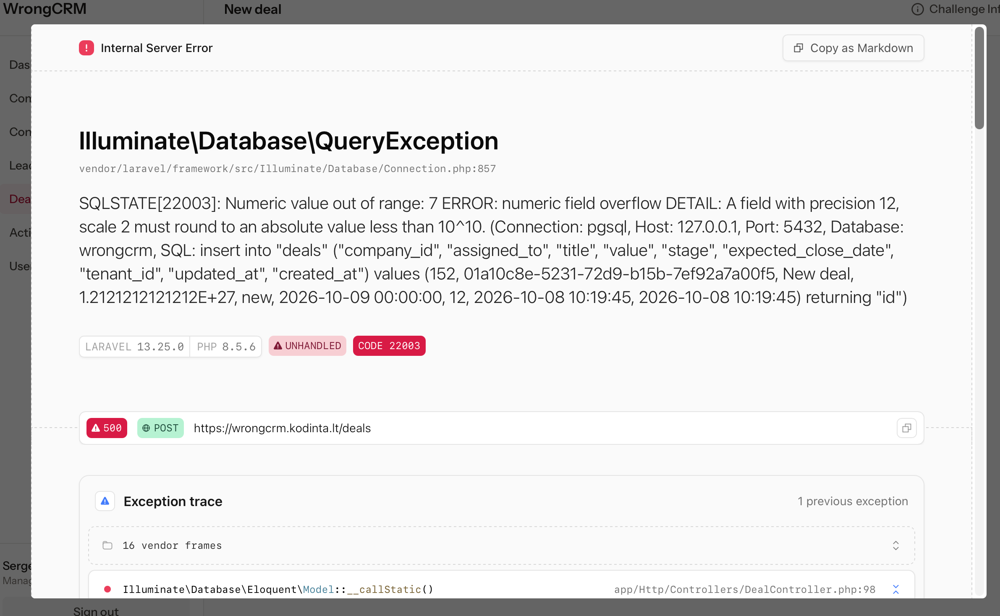

# Bug-04 — [Deals] Oversized deal value return 500 with full debug

- **Severity:** High
- **Area:** Edit deal page, New deal page

## Steps to reproduce
1. Login as salesperson/manager
2. Click on Deals
3. Edit a deal or create a new deal
4. Within value filed enter a large number e.g. "123213123213123213213231"
5. Click on Save changes/Create deal

## Expected result
Validation rejects value, field error is displayed, application stays up

## Actual result
Internal Server Error (500).
Error is not handled and debug page is displayed

## Confidence
Potential security issue as debug data displayed (database name, host, sql statement, request headers

## Screenshots

