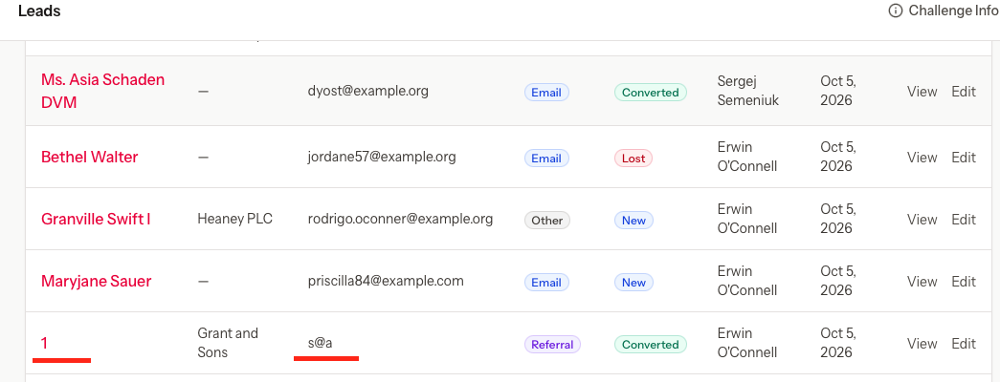

# Bug-13 — [Leads/Contacts] Weak email/phone number validation

- **Severity:** Low
- **Area:** Lead create page, Lead edit page, Contact create page, Contact edit page

## Steps to reproduce
1. Login as manager/salesperson
2. Create a lead with an email "s@" no domain
3. Save changes
4. Proceed to contacts
5. Create/edit a contact with letters in the phone field
6. Save changes

## Expected result
- When a value is provided it is validated for the format. An email such as "s@" is rejected.
- Phone number does not accept aplhabetic characters.

## Actual result
- "s@" is accepted and stores as lead email or contact email.
- the contact phone filed accepts letters.
- also names that are short or single characters are accepted.

## Confidence
"s@" visible in the leads list/contact list; invalid phone accepted on contacts.

## Screenshots

