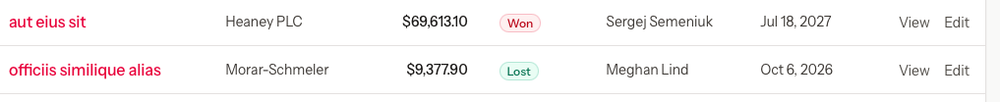

# Bug-16 — [Deals] Lost stage is displayed in green, while Won in red

- **Severity:** Low
- **Area:** Deals list page

## Steps to reproduce
1. Login as manager/Salesperson
2. Proceed to Deals list
3. Check the Lost/Won stage icons

## Expected result
- "Lost" stage icon displayed in red color ("--color-red-50")
- "Won" stage icon displayed in green color ("--color-emerald-50")

## Actual result
Mismatch between lost/won icons.
Lost stage icon displayed in green ("--color-emerald-50"), while Won stage icon displayed in red ("--color-red-50").

## Confidence
Visible.
Minor mismatch in the design

## Screenshots

